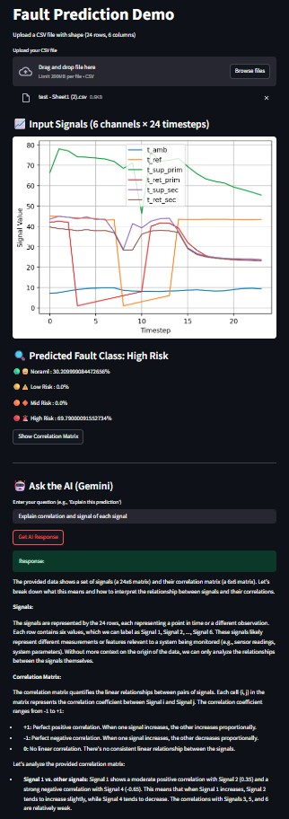

# NLP-for-Energy-System
Web app for early fault detection in district heating systems.

🔥🔍

This is a Streamlit-based application for detecting and classifying thermal faults in district heating systems using a **KAN (Kolmogorov–Arnold Network)** model. Users can upload a CSV file with 6 temperature-related signals over 24 time steps. The app visualizes the signals, computes their correlation, predicts fault levels (Normal, Low Risk, Mid Risk, High Risk), and enables interaction with the **Gemini 1.5 Flash** AI model for explanation and reasoning.

## 🔧 Features

- 📈 Visualize 6 input signals across time
- 🔗 Compute and plot Pearson correlation matrix
- 🤖 Predict fault level using a pretrained KAN model
- 📊 Display class probabilities with emoji indicators
- 🧠 Ask Gemini AI to explain or interpret predictions

## 📁 File Upload Format

- Input CSV file must have **exactly 24 rows and 6 columns**
- Each column corresponds to one signal:
  - `t_amb`, `t_ref`, `t_sup_prim`, `t_ret_prim`, `t_sup_sec`, `t_ret_sec`

